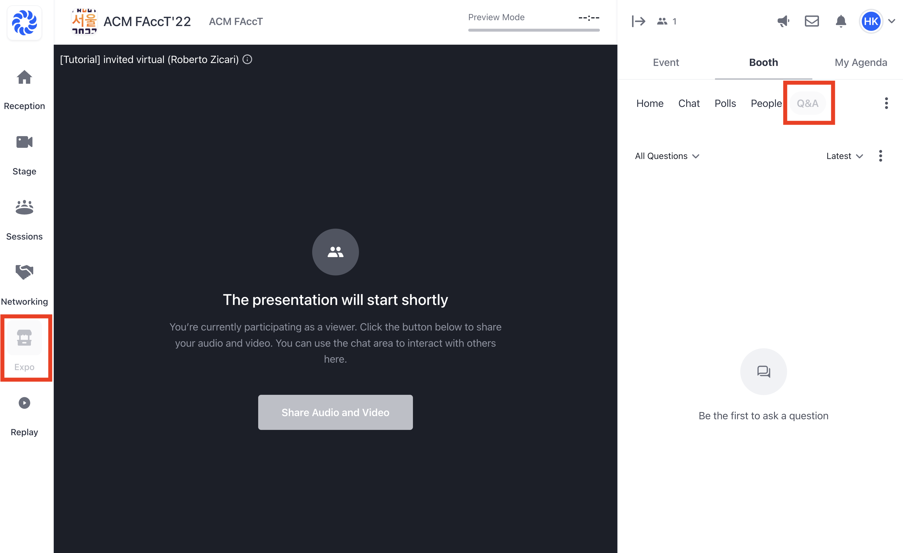
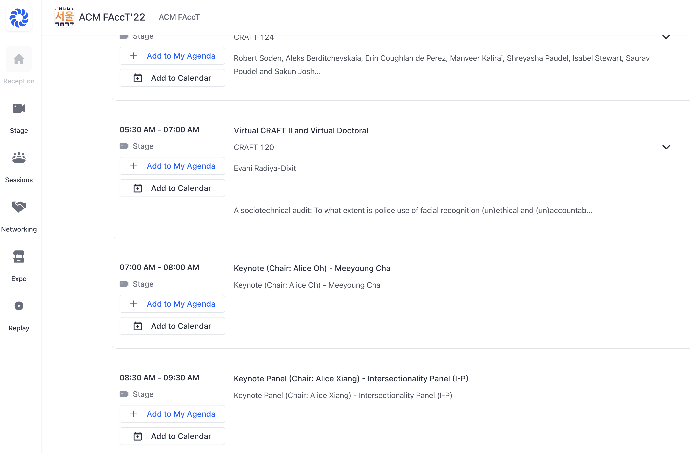
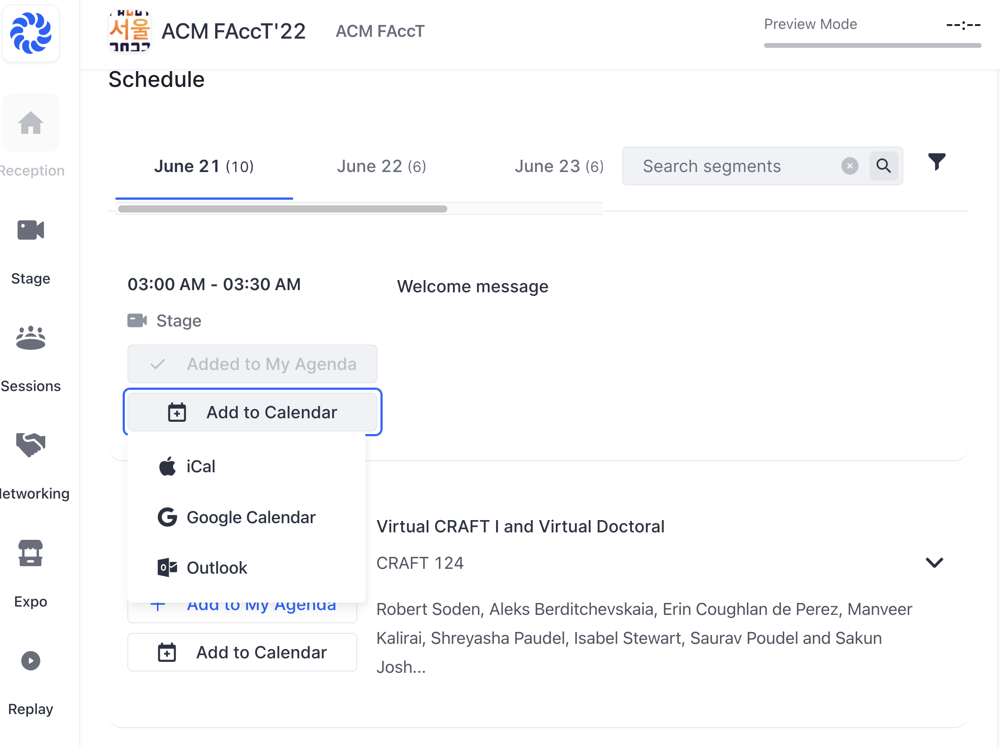
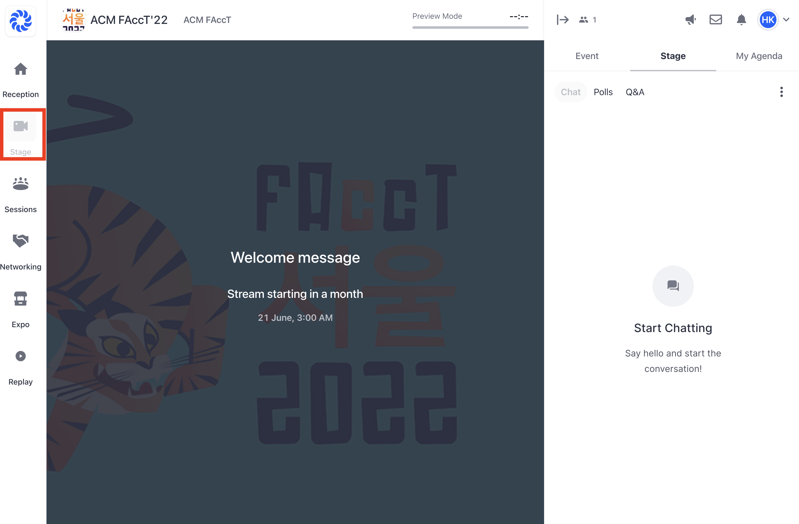
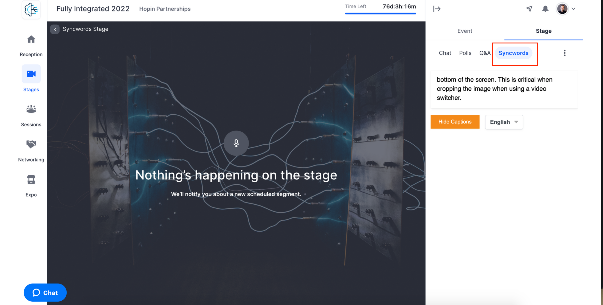

# Accessing the Conference

**QUICK LINKS**
* [Hopin](https://hopin.com/events/acm-facct-22)

Hopin is an integrated platform for watching pre-recorded talks, leaving questions, interacting with other attendees, and more.  
The key features of this year’s event on Hopin are: 

**Pre-recorded talks:** You can watch pre-recorded research presentations  anytime after June 14. 

**Interaction with other attendees:** You can interact with other attendees outside of sessions through the "People" menu at the sidebar. 

**Questions for talks:** You can leave questions under the "Q&A" menu for each paper's "booth" in advance. Session chairs will ask some of the questions from the booth or authors will answer your questions as a reply to your question under the "Q&A" menu. [Watch the live streams and participate in the Q&A on Hopin.](https://hopin.com/events/acm-facct-22)

**Program schedule** will be available under the "Reception" menu. You can add programs that you want to attend to your Agenda (i.e., favorites) or directly to your Calendar for managing them easily. 

Access to live sessions will become available on the scheduled day of the session under the "Stage" menu. We recommend that you log in a few minutes early since all sessions plan to run on time.

Some tips to get the most out of FAccT:

1. **If you are unsure you can attend the sessions live, watch the pre-recorded research paper content in advance of the live Q&A sessions.** All attendees have access to Hopin where they can watch pre-recorded Paper sessions and submit questions before the session starts. Watch the presentations whenever it is best for you!
2. **Ask a question to an author on the paper’s page before the live Q&A.** Your question will be sent to the session chair so they can prepare for the Q&A.  This will help the authors accommodate any questions raised by attendees who watched the content prior to the start of the conference or are unable to attend live.
3. **Visit booths, and discuss with the authors and other attendees about the study you are interested in.** Authors will be instructed specifically to begin monitoring their booths throughout the event. 

## What you need to Attend

**The Right Browser:** We recommend using Chrome for the best user experience. However, our virtual conference portal works well on Safari, Firefox, and Microsoft Edge.

**Access to Internet:** You will need to have access to the internet in order to access the Hub and watch the livestream.

## Conference Agenda

Please note that all conference times on Hopin should show in your local time. Additionally, you will be able to add events to your own calendar.

## Communicating with other attendees during the conference

Given the stress of the past year and virtual nature of FAccT 2022, it’s especially important to reflect on your state of mind as you arrive at the conference, and how you communicate with other attendees over the course of the 14 days.
 
When joining Hopin, we ask that you:
1. **Update your profile.** Please use the same name you gave during registration, for security reasons. Add your personal pronouns to your profile, if you feel comfortable with this.
2. **Introduce yourself** in under the "Chat" menu.
3. **Respectfully communicate with other attendees** via Message/Chats on Hopin. Stop messaging someone if they ask you to. Consent is critical.

For more guidance on this topic, please review our [community guidelines](https://facct22guide.github.io/community.html).

## Accessibility

### Timezones

Below are some of the steps we've taken to make FAccT available for those who are not able to join the livestream and to create opportunities for asynchronous engagement.

All pre-recorded research presentations are available on [Hopin](https://hopin.com/events/acm-facct-22) to view at any time. 

We are encouraging participants to ask questions and engage around papers in "booths" on Hopin, which can be used to ask questions asynchronously. Moderators for each session will be monitoring booths to include these questions in the live Q+A.

Plenary keynotes and panels will be livestreamed and recorded, and they will be posted to Hopin later in the day.
<!-- 
Tutorials will be livestreamed and recorded, and they will be posted to the conference hub on Monday. There are also tutorial spaces in [Circle.so](https://facct.circle.so/c/tutorials) where questions can be asked asynchronously.

CRAFT (which takes place on Friday) will only be live-streamed and not recorded. CRAFT organizers wanted to encourage a participatory environment and chose not to record the sessions. -->
 

### Captioning

All pre-recorded research presentations and keynotes have captions. 

All Plenary live content (including the Keynote Q+As and the Panels) will be captioned by [SyncWords](https://www.syncwords.com/) of human transcriptionists. 

<!-- Those parts of the conference that are interactive and live pose a bit more of a challenge:

* Captions for Tutorials will not appear in the live stream on the conference hub, but will be recorded and made available in the recordings with captions. Attendees who require accomodation will be invited to Zoom in order to view them live. 
* CRAFT sessions will be held in Zoom, and it is our understanding that individuals who join Zoom are able to "turn on" the captioning for themselves.
* Captions for Live Q+As following paper presentations will not appear in the live stream on the conference hub, but will be recorded and made available the following day with captions. 

We realize that the process for tutorials and live paper q+a is not ideal. Please let us know if there are Tutorials or Q+A sessions that you were planning to attend, and we can work with you to figure a zoom-supported option.

Additionally, we want to recognize the variable, and systematic, errors in auto-transcription as provided by Zoom(tutorials), SlidesLive (paper prerecordings) and Youtube (posted recordings of live events).  These concerns were central to our choice to use a paid service for the keynotes and panels, but in order to balance costs, this was not feasible for all sessions.  Keeping costs low is another important dimension of accessibility for our community. -->

### Language
The conference will be presented in English. Please be aware that English is not everyone’s first language. Come prepared to provide definitions and breakdown jargon and regional idioms you may use, when asked.

<!-- ## Accessibility in FAccT Conference Hub Design

Accessibility goes beyond, font size, contrast, and assets. It is about useability for everyone. That is why we designed the FAccT Conference Hub to be as easy and painless to use as possible. On top of being at a success rating of AA or higher according to the Web Content Accessibility Guidelines. 

We asked ourselves is the Hub:
- _Perceivable:_ Can I consume content on my site in different ways? 
- _Operable:_ Can the site function without confusion and without the use of a mouse or complex interactions?
- _Understandable:_ Can a user understand how the user interface of the site functions and the information on the site?
- _Robust:_ Can different assistive devices understand the website?

Other accessibility features:
- Font Size
- AA-AAA Color Contrast 
- Clear Hierarchy
- Alt text 
- ARIA Labels
- Clear Focus States
- Helpful Error States
S- imple Gestures and Meaningful interactions -->

### Security
We have taken many steps to ensure the security and safety of attendees. Here are some of the systems in place:

* Only registered attendees can send questions and interact with other attendees within Hopin. All activity is tied to a single user identity. If there are any verified breaches of the Code of Conduct, the user will not be allowed to access or participate in the conference. For more information, please review the [community guidelines](https://facct22guide.github.io/community.html) and [Policy Against Harassment](https://facct22guide.github.io/conduct.html).
* Chosen organizers will be scanning submitted questions and discussion boards for any content that is considered inappropriate, and will be available during the sessions to address issues when they arise.
* Only approved questions will be shown to attendees during live Q&A sessions.

## Diversity, Equity and Inclusion Initiative

For current information regarding FAccT 2022 Diversity, Equity and Inclusion please visit the [DEI webpage](https://facctconference.org/2022/inclusion.html).

## Getting Support Navigating FAccT

We know that there are many moving pieces during a virtual conference and we don’t want to leave anyone behind.

If you have any questions about:

* The programming and upcoming events, please email program-chairs@facctconference.org.
* Accessibility, diversity and inclusion at the conference, please email the D&I Chair, Maria De-Arteaga at inclusion@facctconference.org.
* Registration, please email facctregistration@executivevents.com.

For live technical support, please contact the organisers here:
<!-- We will check whether Hopin has such feature -->
* On Hopin, we have a dedicated ChatBox for getting technical support. This will be staffed throughout the duration of the event by members of the FAccT Planning Team.
